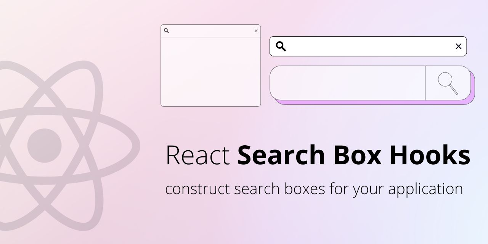

# React Search Box Hooks

This library provides a set of React hooks to construct search boxes for your application.

## Installation

To install the package, use:

```bash
npm i react-search-box-hooks
```
or
```bash
yarn add react-search-box-hooks
```

## Usage

The library provides two hooks: `useSearchBox` and `useSearchBoxInput`.

### useSearchBox

The `useSearchBox` hook provides a state object and an action to update the search parameters, and a method to query the data. It requires two parameters:

- `queryFunc`: The function to query the data. It takes a single argument, the search parameters object, and returns a Promise that resolves to an array of search results and the total number of search results.
- `initParams`: The initial search parameters object.

The `useSearchBox` hook returns an object with the following properties:

- `items`: The array of search results.
- `totalCount`: The total number of search results.
- `isLoading`: A boolean value indicating whether the search is in progress.
- `params`: The search parameters object.
- `dispatchParams`: An action to update the search parameters.

**Example of usage**

```js
function MyComponent() {
  const queryFunc = useCallback((params) => {
    const items = []
    const totalCount = items.length
    resolve([items, totalCount]);
  }, []);

  const { items, totalCount, isLoading, params, dispatchParams } = useSearchBox(queryFunc, { count: 0 });

  const onInc = useCallback(() => {
    dispatchParams({ key: "count", value: params.count + 1 });
  }, [dispatchParams, params]);

  // render the search box UI
}
```

<a href="https://codesandbox.io/s/react-search-box-hooks-usesearchbox-demo-twmewq?fontsize=14&hidenavigation=1&theme=dark" target="_blank">
  
</a>

### useSearchBoxInput

The `useSearchBoxInput` hook provides handlers for the search box input field. It requires three parameters:

- `dispatchParams`: An action to update the search parameters.
- `paramKey`: The key of the search parameter to update.
- `debounceTimeout`: The debounce timeout value in milliseconds.

The `useSearchBoxInput` hook returns an object with the following properties:

- `ref`: A ref to the input element.
- `onInput`: A handler for the input event.
- `onChange`: A handler for the change event.
- `onClear`: A handler for the clear button event.
- `isClearable`: A boolean value indicating whether the clear button should be shown.

**Example of usage**

```js
function MyComponent() {
  const queryFunc = useCallback((params) => {
    const items = Array.from(params.query || "");
    return [items, items.length];
  }, []);

  const { items, totalCount, isLoading, params, dispatchParams } = useSearchBox(queryFunc, { query: 'search-box-hooks' });

  const { ref, onInput, onChange, onClear, isClearable } = useSearchBoxInput( dispatchParams, "query" );

  return (
    <>
        <input
            defaultValue={params.query} 
            {...{ ref, onInput, onChange }}
        />
        {isClearable && <button onClick={onClear}>clear</button>}

        {/* the search box UI */}
    </>
  )
}
```

<a href="https://codesandbox.io/s/react-search-box-hooks-usesearchboxinput-demo-u6ss6u?fontsize=14&hidenavigation=1&theme=dark" target="_blank">
  
</a>

## Contributing

Contributions are welcome. To contribute, fork the repository, create a branch for your changes, and submit a pull request. Please make sure that your changes are covered by tests and that the existing tests pass.

## License

This library is licensed under the MIT License. See the [LICENSE](./LICENSE) file for more information.
